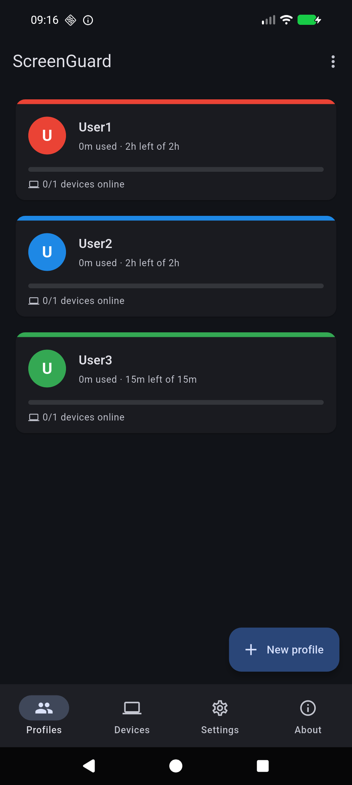
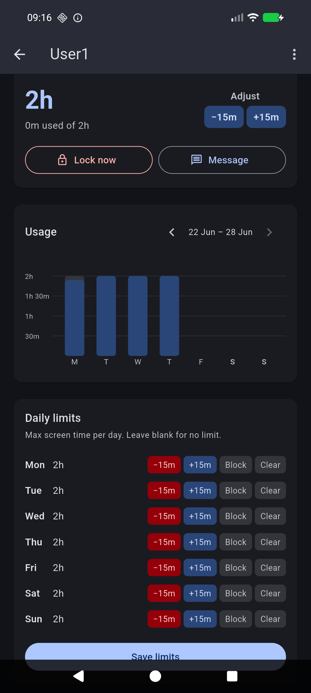
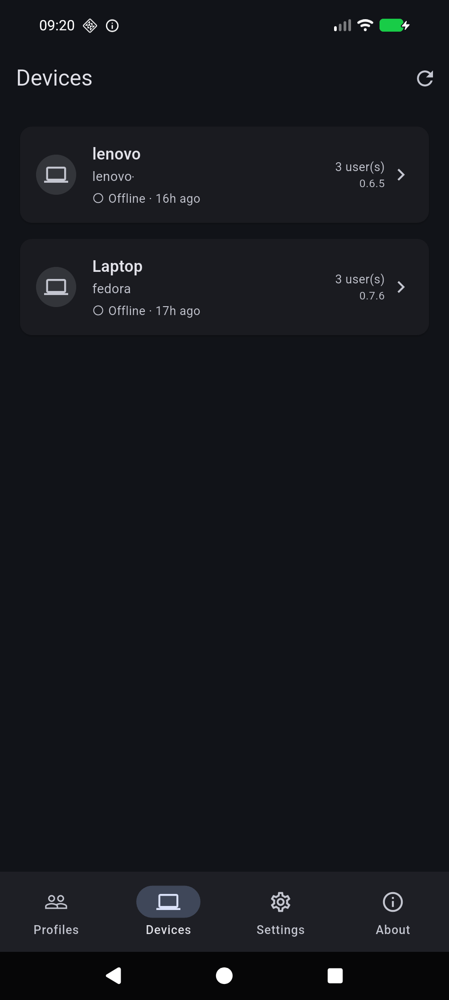

# ScreenGuard

Parental-control screen-time manager for Linux. A lightweight server+agent system that enforces daily screen-time limits and schedules on managed machines.

**Features**

- Daily time limits and weekly schedules per user profile
- Hard enforcement — locks all graphical sessions when time runs out
- Optional session preservation keeps applications and unsaved work running behind the lock screen
- Desktop notifications: warns at 15 / 10 / 5 / 1 minute before lockout
- Admin can send arbitrary text messages to any managed user's desktop
- Time adjustments (add or remove minutes) with optional reason shown to the user
- mDNS auto-discovery — agents find the server on the local network without manual configuration
- Web UI for administration
- Static binaries, no runtime dependencies

## Mobile app

A Flutter Android app is included in the `mobile/` directory. It lets you manage profiles, devices, schedules, and daily limits from your phone — no browser needed.

**Download:** grab `screenguard-android-<version>.apk` from the [latest release](https://github.com/adambie/screenguard/releases/latest) and install it (enable *Install unknown apps* in Android settings first).

**Features**

- mDNS auto-discovery — finds the server on your local network automatically
- Manage profiles: daily limits, schedules, lock now, send messages
- Manage devices: approve/pair, rename, assign users
- Usage charts per profile
- Light/dark theme, 6 UI languages

The app connects directly to the same REST API as the web UI. No extra setup is needed on the server.

<p align="center">
  
  &nbsp;&nbsp;
  
  &nbsp;&nbsp;
  
</p>

## Architecture

```
┌─────────────────────────────────┐        ┌──────────────────────────┐
│  Server machine                 │        │  Managed machine (child) │
│                                 │        │                          │
│  screenguard-server  (REST API) │◄──WS───│  screenguard-agent       │
│  screenguard web UI  (Flask)    │        │  (enforces limits,       │
│                                 │        │   sends notifications)   │
└─────────────────────────────────┘        └──────────────────────────┘
         ▲
         │ REST
    Android app
   (mobile/)
```

The server and agent can run on the same machine or on separate machines. The agent connects to the server over a persistent WebSocket connection. mDNS (Avahi/Bonjour) is used for automatic discovery on the local network.

## Requirements

- Linux with systemd
- x86_64 or aarch64 CPU
- Managed machines: a graphical session manager that supports `loginctl terminate-session` (GNOME, KDE, etc.)
- Server machine: any Linux with systemd; does not need a graphical desktop

## Install

```bash
curl -fsSL https://github.com/adambie/screenguard/releases/latest/download/install.sh | sudo bash
```

The installer will ask whether to install the **agent**, the **server**, or **both**, then configure and start the appropriate systemd services.

### Update

```bash
curl -fsSL https://github.com/adambie/screenguard/releases/latest/download/install.sh | sudo bash -s -- --update
```

This downloads the latest binaries, replaces them, and restarts the services. Configs are not touched.

### Uninstall

```bash
curl -fsSL https://github.com/adambie/screenguard/releases/latest/download/install.sh | sudo bash -s -- --uninstall
```

You will be asked separately whether to remove the config directory and the database.

## Running the server in Docker

`docker-compose.yml` is included at the root of the repository and covers both the server and the web UI. The **agent always runs natively** on the managed (child) machine — it interacts with the desktop session via DBus and cannot run inside a container.

### Host networking (recommended)

The default compose file uses `network_mode: host`. Both containers share the host's network stack, so mDNS auto-discovery works normally — agents on the LAN find the server without any manual configuration.

```bash
# 1. Clone the repo (or download docker-compose.yml + deploy/ separately)
git clone https://github.com/adambie/screenguard.git
cd screenguard

# 2. Set a strong secret key for the web UI session
#    Edit docker-compose.yml and replace "change-me-in-production"

# 3. Start
docker compose up -d

# 4. Open the admin UI
#    http://<server-ip>:5000
```

The database is stored in a named Docker volume (`screenguard-data`) and survives container restarts and image updates.

To pin a specific release instead of always pulling `latest`, set the `VERSION` build arg in `docker-compose.yml`:

```yaml
args:
  VERSION: v0.8.4
```

### Bridge networking

If host networking is not an option (rootless Podman, non-Linux Docker host, strict isolation), the `docker-compose.yml` file contains a commented-out bridge-mode configuration. The key difference: **mDNS auto-discovery does not work in bridge mode** because Docker bridges block multicast. You must configure the server address manually on every managed machine:

```toml
# /etc/screenguard/agent.toml on each managed machine
server_url = "ws://<server-host-ip>:8080"
```

### Updating

```bash
docker compose pull   # if using pre-built images
# or
docker compose build --no-cache   # to rebuild from the latest release binary
docker compose up -d
```

## Firewall

If the server and agents run on **different machines**, the agents need to reach the server's port (default **8080**) over TCP.

**ufw (Ubuntu/Debian)**

```bash
sudo ufw allow 8080/tcp
```

**firewalld (Fedora/RHEL)**

```bash
sudo firewall-cmd --permanent --add-port=8080/tcp
sudo firewall-cmd --reload
```

**mDNS auto-discovery** uses UDP multicast on port 5353. This works out of the box on most home/office networks. If agents fail to find the server automatically, use a fixed URL instead (the installer offers this as an option), or ensure mDNS/multicast traffic is allowed between the machines.

## First-run setup

1. **Server**: after install, open the web UI. On first visit you will be prompted to create an admin account.

2. **Create a profile**: in the web UI, go to Profiles → New profile. Set schedules and daily limits.

3. **Pair an agent**: go to Agents. Each unpaired agent shows a pairing code in its logs:
   ```
   journalctl -u screenguard-agent -f
   ```
   Accept the code in the web UI to pair the agent with the server.

4. **Assign users**: on the agent detail page, assign each local user account to a profile.

## Locking modes

Each profile has two locking modes. The setting defaults to **off**, preserving ScreenGuard's existing behavior.

- **Default (preserve tasks off):** when access is blocked, ScreenGuard locks the login session and terminates the graphical session after the configured grace period.
- **Preserve tasks on:** when access is blocked, ScreenGuard locks and continues re-locking the login session without terminating it. Applications and unsaved work remain running. Once access is restored, the user returns to the existing session.

In both modes, **Lock now** zeroes the user's remaining allowance. The preserve-tasks setting changes only what happens to the graphical session while access remains blocked.

## Configuration

### Server — `/etc/screenguard/server.toml`

```toml
listen_addr      = "0.0.0.0"
listen_port      = 8080
db_path          = "/var/lib/screenguard/server.db"
enable_mdns      = true
jwt_expiry_hours = 24
```

### Agent — `/etc/screenguard/agent.toml`

```toml
# Leave commented out to use mDNS auto-discovery:
# server_url = "http://192.168.1.100:8080"

heartbeat_interval  = 10    # seconds
user_scan_interval  = 300   # seconds
cache_ttl_hours     = 48
min_uid             = 1000  # ignore system accounts below this UID
```

Environment variable overrides: `SCREENGUARD_SERVER_CONFIG`, `SCREENGUARD_AGENT_CONFIG`, `SCREENGUARD_SERVER_DB`.

## Web UI

The web UI is a small Flask app included in the `webui/` directory. It is **not** installed as a service — it is intended for local administration while the server binary handles all agent communication.

```bash
cd webui
SERVER_URL=http://localhost:8080 uv run --with flask --with requests python app.py
```

## Logs

```bash
journalctl -u screenguard-server -f
journalctl -u screenguard-agent -f
```

## Agent reset (re-pair)

If an agent needs to be re-paired (e.g. after moving to a different server):

```bash
screenguard-agent --reset
sudo systemctl restart screenguard-agent
```

## License

GPL-3.0 — see [LICENSE](LICENSE).
